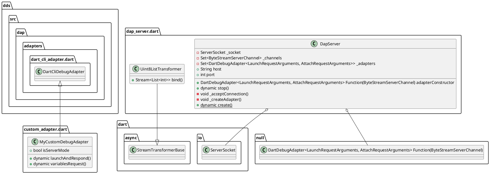

```plantuml
@startuml
set namespaceSeparator ::

class "custom_adapter.dart::MyCustomDebugAdapter" {
  +bool isServerMode
  +dynamic launchAndRespond()
  +dynamic variablesRequest()
}

"dds::src::dap::adapters::dart_cli_adapter.dart::DartCliDebugAdapter" <|-- "custom_adapter.dart::MyCustomDebugAdapter"

class "dap_server.dart::DapServer" {
  -ServerSocket _socket
  -Set<ByteStreamServerChannel> _channels
  -Set<DartDebugAdapter<LaunchRequestArguments, AttachRequestArguments>> _adapters
  +DartDebugAdapter<LaunchRequestArguments, AttachRequestArguments> Function(ByteStreamServerChannel) adapterConstructor
  +String host
  +int port
  +dynamic stop()
  -void _acceptConnection()
  -void _createAdapter()
  {static} +dynamic create()
}

"dap_server.dart::DapServer" o-- "dart::io::ServerSocket"
"dap_server.dart::DapServer" o-- "null::DartDebugAdapter<LaunchRequestArguments, AttachRequestArguments> Function(ByteStreamServerChannel)"

class "dap_server.dart::Uint8ListTransformer" {
  +Stream<List<int>> bind()
}

"dart::async::StreamTransformerBase" <|-- "dap_server.dart::Uint8ListTransformer"


@enduml
```